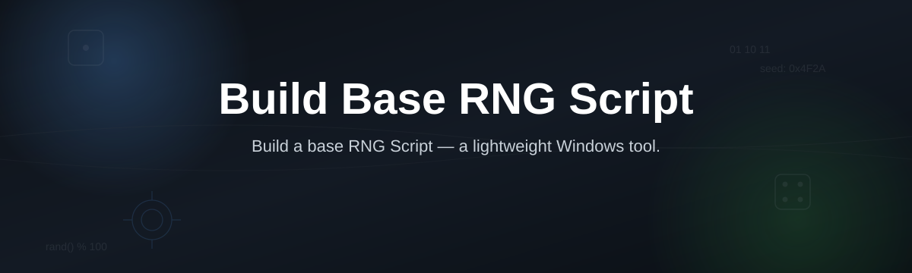
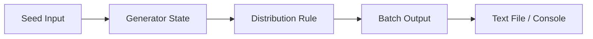

# rng-base-generator

*A base RNG script for people who need reproducible randomness, not a math lecture.*

## What this is

**Before:** you copy random-number code from three different forum threads, none of them agree on seeding, and your output isn't reproducible across runs.

**After:** one script, one seed model, one predictable output — every time you run it.

rng-base-generator is a standalone script that builds a base RNG (random number generator) setup: seed handling, distribution choice, and output format, all in one file you can run and read. It doesn't wrap a library and hide the logic — it *is* the logic, written so you can see exactly what generates each number and why.

The second version people ask for isn't "more random," it's "controllably random." This script covers that: fixed seeds for testing, fresh seeds for production, and a plain-text output you can pipe into anything else you're building.

  

The button above opens the project landing page, where the download starts.

## Who it is for

| Audience | Why they need it |
|---|---|
| Students learning RNG fundamentals | Readable seed-to-output logic, no black box |
| Game devs prototyping loot/roll systems | Fast base generator to bolt custom weights onto |
| QA / test engineers | Reproducible seeds for deterministic test runs |
| Hobby coders on Windows | No toolchain, no setup, just run it |
| Tutorial writers and streamers | A clean baseline to explain, extend, or fork on camera |

## What you can do

| Capability | Detail |
|---|---|
| **Seed control** | Set a fixed seed for repeatable results, or auto-seed per run |
| **Range definition** | Choose min/max bounds without editing core logic |
| **Distribution switch** | Toggle between uniform and weighted output modes |
| **Batch generation** | Produce a list of N values in one call, not one at a time |
| **Plain-text export** | Output writes to a `.txt` file you can pipe elsewhere |
| **Run history log** | Every session's seed and output saved for later checks |
| **Zero dependencies** | Runs as-is — no libraries to install first |
| **Readable source** | One file, commented, no obfuscation |

## Getting started

1. Open the [project landing page](https://LeviathanCobbler.github.io/rng-base-generator/).
2. Download the script package for Windows.
3. Extract it to any folder — no install step.
4. Run the executable or script file directly.
5. Check the output file or console for your generated values.

## Requirements

- Windows 10 or 11 (64-bit)
- No runtime, interpreter, or toolchain to install
- Standalone — runs from any folder, including a USB drive
- ~5 MB free disk space

## How it works

1. Script starts and reads seed input (fixed or auto-generated).
2. Seed initializes the internal generator state.
3. Distribution rule (uniform or weighted) is applied to the range.
4. Values are produced in the requested batch size.
5. Output is written to console and/or a text file.

## FAQ

**What does "base RNG script" actually mean here?**
It's the minimum working generator: seed, range, output — no game logic, no UI, just the core you build on top of.

**Can I reuse the same seed to get identical results?**
Yes. Fixed-seed mode returns the same sequence every run, which is the point for testing.

**Does this replace a proper cryptographic RNG?**
No. This is for scripts, prototypes, and games — not for security-sensitive randomness.

**Why not just use a one-line random function from my language's standard library?**
You can — but this gives you seed logging, batch output, and a file you can hand to someone else without explaining your code.

**Will this work without internet access after download?**
Yes. Once downloaded, it runs fully offline.

## Troubleshooting

- **Script won't launch:** confirm you're on Windows 10/11 and extracted the full folder, not just one file.
- **Output looks identical every run:** you're in fixed-seed mode — switch to auto-seed for fresh values each time.
- **Text file not appearing:** check the script's working folder, not your Downloads folder — output writes next to the executable.
- **Values outside expected range:** verify min/max settings weren't left at defaults from a prior run.

## License

Released under the [MIT License](LICENSE). Provided as-is, without warranty. Use at your own discretion.

  

